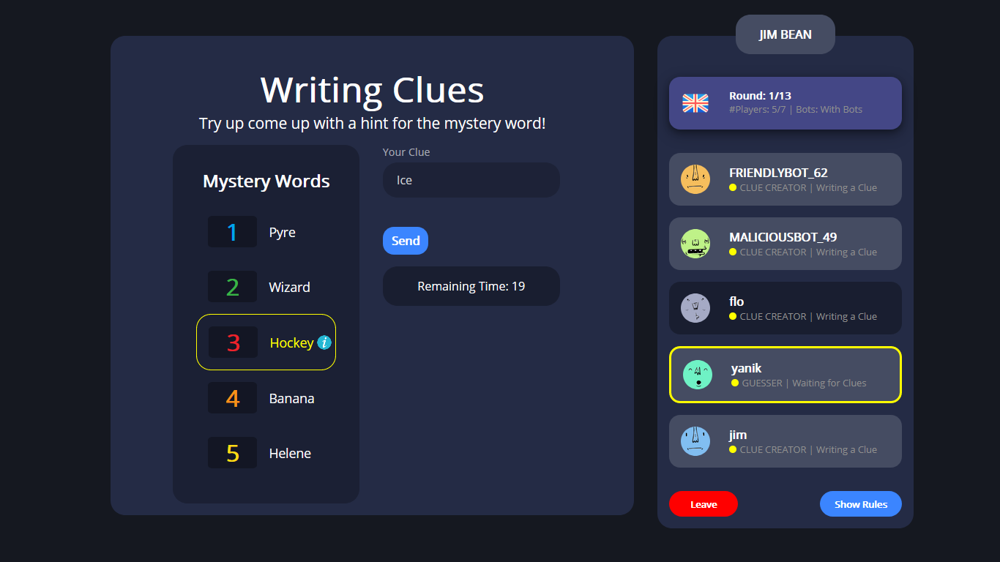

# SoPra FS20 - Just One M4 - Client

## Introduction

Welcome to the digital version of the game Just One! Players are able to register and login and get a good look
at the dashboard. Users can join other lobbies, start a game with different sizes of decks, or play in 
English or German against other Players in real time. There's also a game mode where you can play against Bots. 

Players can also compare each other via a leader Board. Their score will be set according to the 
time they need to come up with the clues and guesses and whether they were eliminated or not.

We are using ReactJS in the Frontend and Java (Spring Boot) in the Backend. The Frontend will interact with the Backend
via a REST API. We decided to consume different external APIs, one in the form of synonyms and antonyms for the Bots
and another to show a definition of a mystery word (if a player doesn’t know what it is).

## Technologies used

We use the JavaScript library React for the Client-Side of Just One. Read and go through those Tutorials, It will make your life easier!

- To learn React, check out the [React documentation](https://reactjs.org/).
- Read the React [Docs](https://reactjs.org/docs/getting-started.html)
- Do this React [Getting Started](https://reactjs.org/tutorial/tutorial.html) Tutorial (it doesn’t assume any existing React knowledge)
- Get an Understanding of [CSS](http://localhost:3000) and [HTML](https://www.w3schools.com/html/html_intro.asp)!

Once you have done all of this, in the template there are two main external dependencies that you should look at:

- [styled-components](https://www.styled-components.com/docs)
  It removes the mapping between components and styles (i.e. external css files). This means that when you're defining your styles, you're actually creating a normal React component, that has your styles attached to it
* [react-router-dom](https://reacttraining.com/react-router/web/guides/quick-start) Declarative routing for React being a collection of navigational components that compose declaratively with your application. 

## High-level components

In this section we'll tell you about three main components and their role.

### Dashboard
As the name suggest the Dashboard is the first Component a user sees when he's logged in. It's the main navigation
for all users. They can choose what they want to do next: Do they want to create a lobby for others to join? Do they 
want to create a lobby with or without bots? Play in German or English? Users can also join an existing lobby from the
dashboard or just have a look at all users that are currently online.

[Dashboard.js](/src/components/game/Dashboard.js)

### LobbyContainer
The LobbyContainer is the Component that you will see when you created a lobby or joined another one. It's the 
starting point to start a new game and invite other players to the lobby. It's also an overview of all players
that already joined the lobby.

[LobbyContainer.js](/src/components/game/Lobby/LobbyContainer.js)

### Playing Container
The PlayingContainer is the heart of the actual game in the frontend. It manages which components are shown at what 
point of the game. It does so by looking at the status of the player of the client and matching that to the correct
component that corresponds to that status. On the other hand it also has the task to connect to the server every 
second to get the newest information about the lobby and pass that information on to the component one level down.

[PlayingContainer.js](/src/components/game/Playing/PlayingContainer.js)

## Launch & Deployment 

### Prerequisites and Installation

For your local development environment you'll need Node.js >= 8.10. You can download it [here](https://nodejs.org). All other dependencies including React get installed with:

#### `npm install`

This has to be done before starting the application for the first time (only once).

#### `npm run dev`

Runs the app in the development mode. 
Open [http://localhost:3000](http://localhost:3000) to view it in the browser.

The page will reload if you make edits. 
You will also see any lint errors in the console (use Google Chrome!).

#### `npm run build`

Builds the app for production to the `build` folder. 
It correctly bundles React in production mode and optimizes the build for the best performance.

The build is minified and the filenames include the hashes. 
Your app is ready to be deployed!

See the section about [deployment](https://facebook.github.io/create-react-app/docs/deployment) for more information.

Once you push a new commit to this repository it will automatically be deployed and released on 
[heroku](https://sopra-fs20-group-05-client.herokuapp.com/login).

## Illustrations

In this section you can have a look the the main user flow of the interface and how different views interacts with 
each other.

### Login and Register
To play our version of the game Just One you first need to create a new user account. With that account you will be 
able to login.

### Dashboard
After login you can see other Players that are online right now, open lobbies that you can join and you can create your
own lobby.

### Profile
If you click on your own Profile picture in the sidebar you get to your own profile. This is the place where you can 
edit your information (and e.g. change your username) or delete your account if you don't want to play anymore.

### Rules
If you've never played Just One before, you can have a look at the rules to know how to play.

### Lobby
In the lobby you can see who you will be playing with, if there are any Bots that will join and how many cards will be 
played in this lobby. If there are any available Players you can also invite these to join your lobby.
For the lobby to start, all players have to set their status to ready.

### Playing
__Once the lobby started playing there are a lot of different views. Here are the 6 main screens:__

__1. Choosing the number:__ The active Player gets to choose a number which will determine the mystery word.

__2. Accepting the Mystery Word:__ All teammates get to accept or decline the chosen mystery word e.g. when they don't 
understand that word.

__3. Write Clues:__ If you're not the active Player you get to write clues. If you're only 3 Players in the game you 
can even write two!

__4. Reviewing Clues:__ Once all Players have submitted their clues you get to review the clues before they are sent 
to the active Player to guess. Here you can eliminate all Clues that are not allowed by the game rules.

__5. Guessing:__ The active Players gets to guess the Mystery Word.

__6. End of Round:__ After each Round the Players get to a screen which states how many Cards are still remaining 
in the deck and how many card the team has won and/or lost. After a 5 seconds countdown the creator of the lobby is 
able to start the next round.

### End of Game Ranking
After all Cards were played the team can see which player got how many points for his performance in the game. 
Players can sort by Name, Score and other attributes by clicking on them.

### Overall Ranking
Once you're out of the game you can have a look at the overall ranking. This is where you can compare yourselve against 
all other user that created an account. Players can sort by Name, Score and other attributes by clicking on them.

## Roadmap

Here are three features that you, as a new member of our team, could contribute to this project!

### Adding custom Mystery-Word Cards

As a User I want to be able to add mystery word cards to the Game in order to keep the game interesting and avoid 
playing the same words over and over again.
- On the Lobby-Page there should be a button that opens a add-mystery-word-card form
- In the form there should be five empty spaces to put five mystery words.
- The mystery word should be put to the list of mystery-word-cards.
- The user should be able to specify to which language the card should belong.

### Let the active Player choose which Clue was the best one

As an active Player, I want to be able to choose the best clue presented in order to award the player who wrote 
it some extra points.
- All Clues should be visible to the active Player.
- The active Player should be able to click on the best clue.
- The Player that wrote the chosen clue should get extra points.
- The active Player should be able to skip if no clue stands out.

### Frontend German Language

As a user if I join a lobby that plays in German I want to play the whole game in German (and not just the words).
- Translated text to German for all content inside a lobby.

## Authors and acknowledgement

### Authors
- [Adiboeh](https://github.com/Adiboeh)
- [Floribur](https://github.com/Floribur)
- [nmulle](https://github.com/nmulle)
- [yritz](https://github.com/yritz)
- [mgoki](https://github.com/mgoki)
- [InfoYak](https://github.com/InfoYak)

We would like to extend our thanks to anyone who has supported us through this challenging project. 
Also, we'd like to especially mention our TA Anja Koller whose advice and guidance was very valuable to us.

### Credits to the APIs that werde used in this project:
- [Adorable Avatars API](http://avatars.adorable.io/) for the profile pictures
- [Language API](https://languages.oup.com/) for the definitions of the mystery words
- [Datamuse API](https://www.datamuse.com/api/) for synonyms and antonyms of the bots.

## License

[MIT License](https://choosealicense.com/licenses/mit/)

Copyright (c) 2020 Sopra Group 05

Permission is hereby granted, free of charge, to any person obtaining a copy
of this software and associated documentation files (the "Software"), to deal
in the Software without restriction, including without limitation the rights
to use, copy, modify, merge, publish, distribute, sublicense, and/or sell
copies of the Software, and to permit persons to whom the Software is
furnished to do so, subject to the following conditions:

The above copyright notice and this permission notice shall be included in all
copies or substantial portions of the Software.

THE SOFTWARE IS PROVIDED "AS IS", WITHOUT WARRANTY OF ANY KIND, EXPRESS OR
IMPLIED, INCLUDING BUT NOT LIMITED TO THE WARRANTIES OF MERCHANTABILITY,
FITNESS FOR A PARTICULAR PURPOSE AND NONINFRINGEMENT. IN NO EVENT SHALL THE
AUTHORS OR COPYRIGHT HOLDERS BE LIABLE FOR ANY CLAIM, DAMAGES OR OTHER
LIABILITY, WHETHER IN AN ACTION OF CONTRACT, TORT OR OTHERWISE, ARISING FROM,
OUT OF OR IN CONNECTION WITH THE SOFTWARE OR THE USE OR OTHER DEALINGS IN THE
SOFTWARE.

>Thanks to Lucas Pelloni for the template
